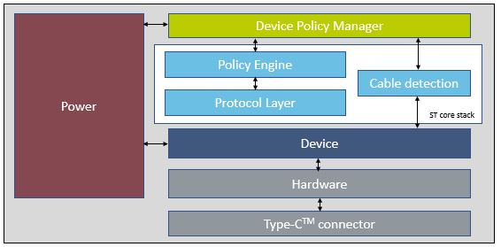

# X-CUBE-TCPP MCU Firmware Package

**X-CUBE-TCPP** is an STMicroelectronics original initiative. It uses for USB Type-C and Power Delivery software expansion for STM32Cube 
([UM2285](https://www.st.com/resource/en/user_manual/dm00432311-development-guidelines-for-stm32cube-expansion-packages-stmicroelectronics.pdf)).

**X-CUBE-TCPP** is a USB-IF certified Expansion Package (**USB Type-C Rev 1.2 and Power Delivery 3.0 with 100 W PPS support**) and consists of libraries, drivers, sources, APIs and application examples 
running on STM32 Series GP microcontrollers embedding Type-C and power delivery management (thanks to the embedded UCPD PHY integrated in STM32G4, STM32G0 and STM32L5).

For the other STM32 GP MCU without embedded UCPD PHY (like STM32L4, STM32F0...), this package demonstrates how to comply with Type-C specification. 

All the applications available in this package need to have either the [TCPP01-M12](https://www.st.com/en/protection-devices/tcpp01-m12.html) or the [TCPP03-M20](https://www.st.com/en/protection-devices/tcpp03-m20.html) integrated. 

The TCPP01-M12 (Type-C port protection) is a single chip solution for USB Type-C port protection that facilitates the migration from USB legacy connectors type-A or type-B to USB Type-C connectors. 
The TCPP03-M20 (Type-C port protection) is a single chip solution for USB Type-C port protection in the context of Dual Role Power applications. 

STMicroelectronics package has been certified by USB-IF through the reference [TID 3036](https://cms.usb.org/usb/cms/device/40004) and [TID 5205](https://cms.usb.org/usb_device/certificate/42552).   

Check the ST web page : [USB Type-C and Power Delivery](https://www.st.com/content/st_com/en/stm32-usb-c.html) for more details.

The figure below shows the overall architecture:

## Boards available
  * [NUCLEO-G071RB](https://www.st.com/en/evaluation-tools/nucleo-g071rb.html), [NUCLEO-G474RE](https://www.st.com/en/evaluation-tools/nucleo-g474re.html) and [NUCLEO-L412RB-P](https://www.st.com/en/evaluation-tools/nucleo-l412rb-p.html)

  * [X-NUCLEO-USBPDM1](https://www.st.com/content/st_com/en/products/ecosystems/stm32-open-development-environment/stm32-nucleo-expansion-boards/stm32-ode-power-drive-hw/x-nucleo-usbpdm1.html)
  

  * [X-NUCLEO-SNK1M1](https://www.st.com/content/st_com/en/products/ecosystems/stm32-open-development-environment/stm32-nucleo-expansion-boards/stm32-ode-power-drive-hw/x-nucleo-snk1m1.html)
  

  * [X-NUCLEO-DRP1M1](https://www.st.com/content/st_com/en/products/ecosystems/stm32-open-development-environment/stm32-nucleo-expansion-boards/stm32-ode-power-drive-hw/x-nucleo-drp1m1.html)
  

## Applications
|   Applications     |     Board     | Shield                     |       Short Description      |
|--------------------|---------------|----------------------------|------------------------------|
| [USBPDM1_Sink_PPS](./Projects/NUCLEO-G071RB/Applications/USB_PD/USBPDM1_Sink_PPS)| NUCLEO-G071RB | X-NUCLEO-USBPDM1|Use of USB Power Delivery (USB-PD) Consumer application (with **PPS**) running on STM32G0XX devices, with X-NUCLEO-USBPDM1 shield plugged.|
| [USBPDM1_Sink_LPM](./Projects/NUCLEO-G071RB/Applications/USB_PD/USBPDM1_Sink_LPM)| NUCLEO-G071RB | X-NUCLEO-USBPDM1|Use of USB Power Delivery (USB-PD) Consumer application (with **Low Power Mode**) running on STM32G0XX devices, with X-NUCLEO-USBPDM1 shield plugged.|
| [USBPDM1_Sink](./Projects/NUCLEO-G474RE/Applications/USB_PD/USBPDM1_Sink)| NUCLEO-G474RE | X-NUCLEO-USBPDM1|Use of USB Power Delivery (USB-PD) Consumer application running on STM32G4XX devices, with X-NUCLEO-USBPDM1 shield plugged.|
| [SNK1M1_Sink](./Projects/NUCLEO-G071RB/Applications/USB_PD/SNK1M1_Sink)| NUCLEO-G071RB | X-NUCLEO-SNK1M1|Use of USB Power Delivery (USB-PD) Consumer application (with **PPS**) running on STM32G0XX devices, with X-NUCLEO-SNK1M1 shield plugged.|
| [SNK1M1_Sink](./Projects/NUCLEO-G474RE/Applications/USB_PD/SNK1M1_Sink)| NUCLEO-G474RE | X-NUCLEO-SNK1M1|Use of USB Power Delivery (USB-PD) Consumer application (with **PPS** and **USB MSC** cohabitation) running on STM32G4XX devices, with X-NUCLEO-SNK1M1 shield plugged.|
| [SNK1M1_Sink_TypeC_Only](./Projects/NUCLEO-L412RB-P/Applications/USB_PD/SNK1M1_Sink_TypeC_Only)| NUCLEO-L412RB-P | X-NUCLEO-SNK1M1|Use of Type-C Consumer application (with **USB MSC** enumeration) running on STM32L4XX devices, with X-NUCLEO-SNK1M1 shield plugged.|
| [DRP1M1_DRP](./Projects/NUCLEO-G071RB/Applications/USB_PD/DRP1M1_DRP)| NUCLEO-G071RB | X-NUCLEO-DRP1M1|Use of USB Power Delivery (USB-PD) DRP application running on STM32G0XX devices, with X-NUCLEO-DRP1M1 shield plugged.|
| [DRP1M1_Sink_PPS](./Projects/NUCLEO-G071RB/Applications/USB_PD/DRP1M1_Sink_PPS)| NUCLEO-G071RB | X-NUCLEO-DRP1M1|Use of USB Power Delivery (USB-PD) Consumer application (with **PPS**) running on STM32G0XX devices, with X-NUCLEO-DRP1M1 shield plugged.|
| [DRP1M1_DRP](./Projects/NUCLEO-G474RE/Applications/USB_PD/DRP1M1_DRP)| NUCLEO-G474RE | X-NUCLEO-DRP1M1|Use of USB Power Delivery (USB-PD) DRP application running on STM32G4XX devices, with X-NUCLEO-DRP1M1 shield plugged.|

This Expansion Package is demonstrated on one hardware implementation, but can easily be ported to any STM32 including the UCPD periperal.

## Development Toolchains and Compilers
- IAR Embedded Workbench for ARM (EWARM) toolchain V8.50.6 + STLink/V2
- Keil Microcontroller Development Kit (MDK-ARM) toolchain V5.31 + ST-LINK/V2
- [STM32CubeIDE V1.7.0](https://www.st.com/en/development-tools/stm32cubeide.html) + ST-LINK/V2 

## Included features
* [STM32CubeMonUCPD](https://www.st.com/en/development-tools/stm32cubemonucpd.html): Monitoring and configuration software tool for STM32 USB-C and Power Delivery 3.0 applications 

## Documentation
 * Application Note [AN5225 : USB Type-C™ Power Delivery using STM32xx Series MCUs and STM32xxx
Series MPUs](https://www.st.com/resource/en/application_note/dm00536349-usb-typec-power-delivery-using-stm32xx-series-mcus-and-stm32xxx-series-mpus-stmicroelectronics.pdf)
 
 * User manual [UM2552 : Managing USB power delivery stack with STM32 microcontrollers](https://www.st.com/resource/en/user_manual/dm00598101-managing-usb-power-delivery-systems-with-stm32-microcontrollers-stmicroelectronics.pdf)
 
 * **Wiki** to create a simple sink application from STM32CubeMX: [STM32 Advance USB-Power Delivery Sink](https://wiki.st.com/stm32mcu/wiki/STM32StepByStep:STM32_Advance_USB-Power_Delivery_Sink)
 
 * **Wiki** to create a simple source application from STM32CubeMX: [STM32 Advance USB-Power Delivery Source](https://wiki.st.com/stm32mcu/wiki/STM32StepByStep:STM32_Advance_USB-Power_Delivery_Source)
 
 * An application note to create a simple application from STM32CubeMX is available at this link : [AN5418](https://www.st.com/resource/en/application_note/dm00663511-how-to-build-a-simple-usbpd-sink-application-with-stm32cubemx-stmicroelectronics.pdf)

 * Corresponding video [here](https://www.youtube.com/watch?v=-vsJhNIaHxE&feature=youtu.be)

## License and release history
Details about the content of this release are available in the release note [here](https://htmlpreview.github.io/?https://github.com/STMicroelectronics/x-cube-tcpp/blob/main/Release_Notes.html).

## Troubleshooting

**Caution** : The **Issues** requests are strictly limited to submit problems or suggestions related to the software delivered in this repo 

**For any question** related to this solution, the hardware performance, the hardware characteristics, the tools, the environment, you can submit a topic on the [ST Community/STM32 MCUs forum](https://community.st.com/s/group/0F90X000000AXsASAW/stm32-mcus)
